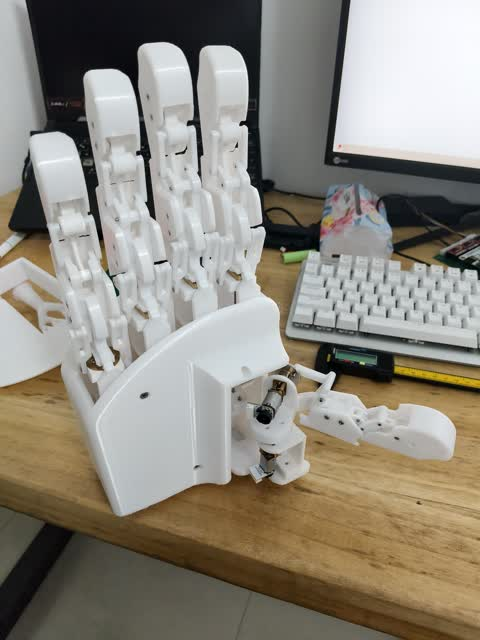
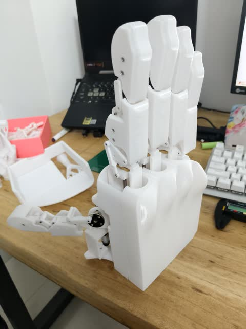
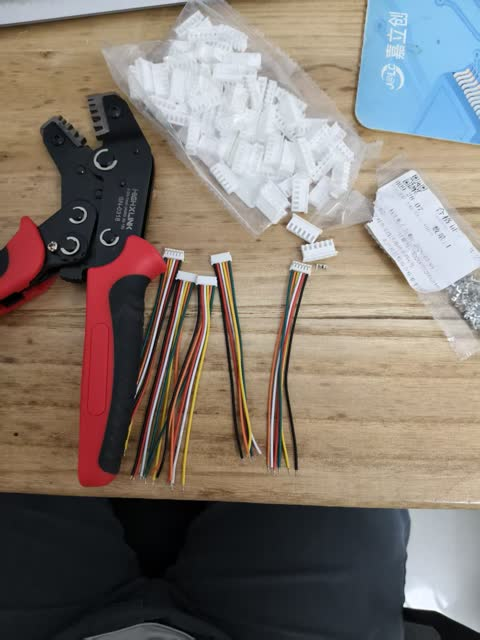
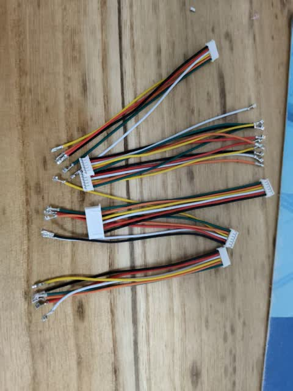
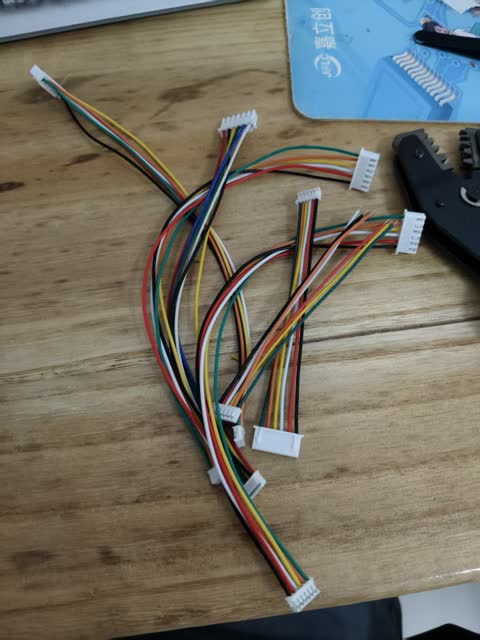
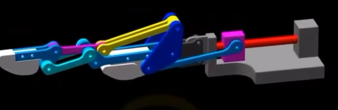

# 6DOF_RobotHand
六自由度的欠驱连杆拟人手(6DOF_Robot Hand)，较低成本，但是体积太大，没有负载，只是个有趣的摆件小玩具吧，后续会优化体积，但是后续多久就随缘了，如果对您有帮助，麻烦点个star，这是我真正意义上的开源项目。
最近对灵巧手比较感兴趣，自己又有一台3D打印机，就动手简单做了一个欠连杆的六自由度拟人手，就不叫灵巧手了，因为太慢了，只是个小玩具而已
    
  

# 硬件
硬件并无详细检查，各种芯片电阻电容，外购件，3D打印耗材，成本应该大致五百元左右，端子线我是自己压的，其他详细请查阅./hardware

# 软件

软件使用的是keil5进行编程
详细请查阅./software

# 感谢
灵感来源”仿生手指结构“
https://www.bilibili.com/video/BV1944y1L7Q4?t=0.9

